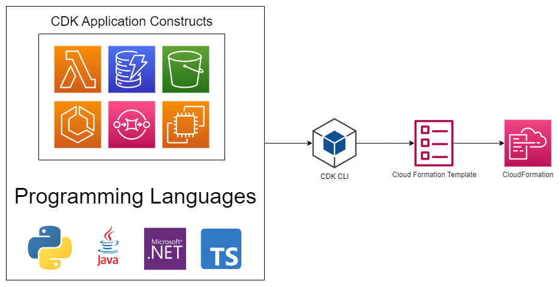

# AWS CDK - Cloud Development Kit<!-- omit in toc -->

## Contents <!-- omit in toc -->

- [1. Introduction](#1-introduction)
- [2. CDK in a diagram](#2-cdk-in-a-diagram)
- [3. CDK vs SAM](#3-cdk-vs-sam)
- [4. Constructs](#4-constructs)
  - [4.1. Layer 1 Constructs (L1)](#41-layer-1-constructs-l1)
  - [4.2. Layer 2 Constructs (L2)](#42-layer-2-constructs-l2)
  - [4.3. Layer 3 Constructs (L3)](#43-layer-3-constructs-l3)
- [5. CDK - Important Commands to know](#5-cdk---important-commands-to-know)
- [6. Bootstrapping](#6-bootstrapping)
- [7. Testing](#7-testing)

# 1. Introduction

- Define your cloud infrastructure using a familiar language:
  - JavaScript/TypeScript.
  - Python.
  - Java.
  - .NET.
- Contains high level components called **constructs**.
- The code is "compiled" into a CloudFormation template (JSON/YAML).
- You can therefore deploy infrastructure and application runtime code together.
  - Great for Lambda functions.
  - Great for Docker containers in ECS / EKS.

# 2. CDK in a diagram

# 3. CDK vs SAM

- **SAM:**
  - Serverless focused.
  - Write your template declaratively in JSON or YAML.
  - Great for quickly getting started with Lambda.
  - Leverages CloudFormation.
- **CDK:**
  - All AWS services.
  - Write infra in a programming language:
    - JavaScript/TypeScript.
    - Python.
    - Java.
    - .NET.
  - Leverages CloudFormation.

# 4. Constructs

- CDK Construct is a component that encapsulates everything CDK needs to create the final CloudFormation stack.
- Can represent a single AWS resource (e.g., S3 bucket) or multiple related resources (e.g., worker queue with compute).
- **AWS Construct Library**
  - A collection of Constructs included in AWS CDK which contains Constructs for every AWS resource.
  - Contains 3 different levels of Constructs available (L1, L2, L3).
- **Construct Hub:** Contains additional Constructs from AWS, 3rd parties, and open-source CDK community.

## 4.1. Layer 1 Constructs (L1)

- Can be called **CFN Resources** which represents all resources directly available in CloudFormation.
- Constructs are periodically generated from **CloudFormation Resource Specification**.
- Construct names start with **Cfn** (e.g., **CfnBucket**).
- **You must explicitly configure all resource properties.**

## 4.2. Layer 2 Constructs (L2)

- Represents AWS resources but with a higher level (intent-based API).
- Similar functionality as L1 but with convenient defaults and boilerplate.
  - You don't need to know all the details about the resource properties.
- Provide methods that make it simpler to work with the resource (e.g., **bucket.addLifeCycleRule()**).

## 4.3. Layer 3 Constructs (L3)

- Can be called **Patterns**, which represents multiple related resources.
- Helps you complete common tasks in AWS.
- Examples:
  - **aws-apigateway.LambdaRestApi** represents an API Gateway backed by a Lambda function.
  - **aws-ecs-patterns.ApplicationLoadBalancerFargateService** which represents an architecture that includes a Fargate cluster with Application Load Balancer.

# 5. CDK - Important Commands to know

| Command                    | Description                                        |
| -------------------------- | -------------------------------------------------- |
| npm install -g aws-cdk-lib | Install the CDK CLI and libraries                  |
| cdk init app               | Create a new CDK project from a specified template |
| cdk synth                  | Synthesizes and prints the CloudFormation template |
| cdk bootstrap              | Deploys the CDK Toolkit staging Stack              |
| cdk deploy                 | Deploy the Stack(s)                                |
| cdk diff                   | View differences of local CDK and deployed Stack   |
| cdk destroy                | Destroy the Stack(s)                               |

# 6. Bootstrapping

- The process of provisioning resources for CDK before you can deploy CDK apps into an AWS Environment.
  - **AWS Environment = account & region.**
- CloudFormation Stack called **CDKToolkit** is created and contains:
  - **S3 Bucket:** To store files
  - **IAM Roles:** To grant permissions to perform deployments
- You must run the following command for each new environment:
  - `cdk bootstrap aws://<aws_account>/<aws_region>`
- Otherwise, you will get an **error "Policy contains a statement with one or more invalid principal"**.

# 7. Testing

- To test CDK apps, use **CDK Assertions Module** combined with popular test frameworks such as Jest (JavaScript) or Pytest (Python).
- Verify we have specific resources, rules, conditions, parameters...
- Two types of tests:
  - **Fine-grained Assertions (common):** Test specific aspects of the CloudFormation template (e.g., check if a resource has this property with this value)
  - **Snapshot Tests:** Test the synthesized CloudFormation template against a previously stored baseline template
- To import a template
  - Template.fromStack(MyStack) : stack built in CDK
  - Template.fromString(mystring) : stack build outside CDK
