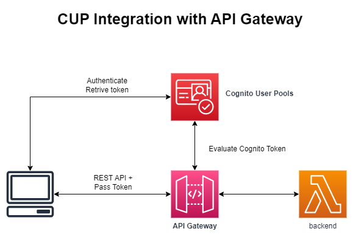
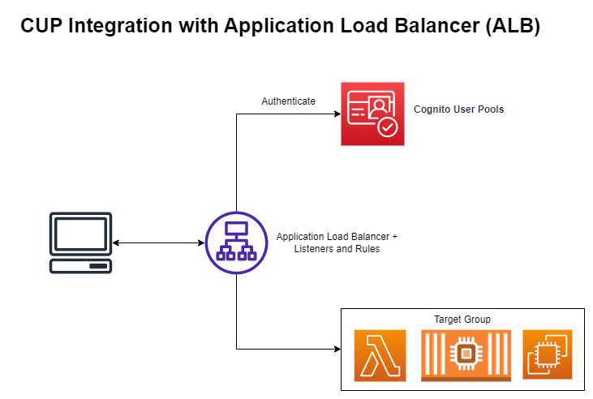
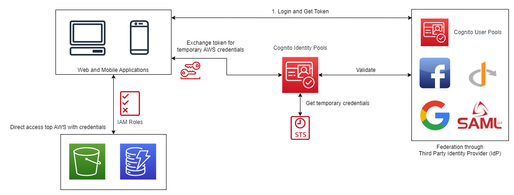

# AWS Cognito <!-- omit in toc -->

## Contents <!-- omit in toc -->

- [1. Introduction](#1-introduction)
- [2. Cognito sync store](#2-cognito-sync-store)
- [3. Cognito User Pools (CUP)](#3-cognito-user-pools-cup)
  - [3.1. User Features](#31-user-features)
  - [3.2. Integrations](#32-integrations)
  - [3.3. Lambda Triggers](#33-lambda-triggers)
  - [3.4. Hosted Authentication UI](#34-hosted-authentication-ui)
    - [3.4.1. Hosted UI Custom Domain](#341-hosted-ui-custom-domain)
  - [3.5. Adaptive Authentication](#35-adaptive-authentication)
  - [3.6. Decoding a ID Token; JWT - JSON Web Token](#36-decoding-a-id-token-jwt---json-web-token)
  - [3.7. ALB - Authenticate Users](#37-alb---authenticate-users)
  - [3.8. ALB - Auth through Cognito User Pools](#38-alb---auth-through-cognito-user-pools)
    - [3.8.1. ALB - Auth. Through an Identity Provider (IdP) That is OpenID Connect (OIDC) Compliant](#381-alb---auth-through-an-identity-provider-idp-that-is-openid-connect-oidc-compliant)
- [4. Cognito Identity Pools (Federated Identities)](#4-cognito-identity-pools-federated-identities)
  - [4.1. Developer Authenticated](#41-developer-authenticated)
  - [4.2. IAM Roles](#42-iam-roles)
- [5. Cognito User Pools vs Identity Pools](#5-cognito-user-pools-vs-identity-pools)

# 1. Introduction

- Give users an identity to interact with our web or mobile application.
- **Cognito User Pools (CUP)**
  - Sign in functionality for app users.
  - Integrate with API Gateway & Application Load Balancer.
- **Cognito Identity Pools (Federated Identity)**
  - Provide AWS credentials to users so they can access AWS resources directly.
  - Integrate with Cognito User Pools as an identity provider.
- **Cognito vs IAM**: "hundreds of users", "mobile users", "authenticate with SAML".

# 2. Cognito sync store

- The Amazon Cognito Sync store is a key/value pair store linked to an Amazon Cognito identity.
- There is no limit to the number of identities you can create in your identity pools and sync store.
- Each Amazon Cognito identity within the sync store has its own user information store.

# 3. Cognito User Pools (CUP)

## 3.1. User Features

- Create a serverless database of user for your web & mobile apps.
- Simple login: Username (or email) / password combination.
- Password reset.
- Email & Phone Number Verification.
- Multi-factor authentication (MFA).
- Federated Identities: users from Facebook, Google, SAML...
- Feature: block users if their credentials are compromised elsewhere.
- Login sends back a JSON Web Token (JWT).

  

## 3.2. Integrations

- CUP integrates with API Gateway and Application Load Balancer.
  
  

## 3.3. Lambda Triggers

- CUP can invoke a Lambda function synchronously on these triggers: [Reference](https://docs.aws.amazon.com/cognito/latest/developerguide/cognito-user-identity-pools-working-with-aws-lambda-triggers.html)

## 3.4. Hosted Authentication UI

- Cognito has a hosted authentication UI that you can add to your app to handle sign-up and sign-in workflows.
- Using the hosted UI, you have a foundation for integration with social logins, OIDC or SAML.
- Can customize:
  - Custom logo.
  - Custom CSS.
- [Reference](https://aws.amazon.com/blogs/aws/launch-amazon-cognito-user-pools-general-availability-app-integration-and-federation/)

### 3.4.1. Hosted UI Custom Domain

- For custom domains, you must create an ACM certificate in us-east-1.
- The custom domain must be defined in the "App Integration" section.

## 3.5. Adaptive Authentication

- **Block sign-ins or require MFA if the login appears suspicious.**
- Cognito examines each sign-in attempt and generates a risk score (low, medium, high) for how likely the sign-in request is to be from a malicious attacker.
- Users are prompted for a second MFA only when risk is detected.
- Risk score is based on different factors such as if the user has used the same device, location, or IP address.
- Checks for compromised credentials, account takeover protection, and phone and email verification.
- Integration with CloudWatch Logs (sign-in attempts, risk score, failed challenges...).

## 3.6. Decoding a ID Token; JWT - JSON Web Token

- CUP issues JWT tokens (Base64 encoded):
  - **Header**
  - **Payload**
  - **Signature**
- **The signature must be verified to ensure the JWT can be trusted.**
- Libraries can help you verify the validity of JWT tokens issued by Cognito User Pools.
- The Payload will contain the user information (sub UUID, given_name, email, phone_number, attributes...).
- From the sub UUID, you can retrieve all users details from Cognito / OIDC.

## 3.7. ALB - Authenticate Users

- Your Application Load Balancer can securely authenticate users:
  - Offload the work of authenticating users to your load balancer.
  - Your applications can focus on their business logic.
- Authenticate users through:
  - Identity Provider (IdP): OpenID Connect (OIDC) compliant.
  - Cognito User Pools:
    - Social IdPs, such as Amazon, Facebook, or Google.
    - Corporate identities using SAML, LDAP, or Microsoft AD.
- **Must use an HTTPS listener to set authenticate-oidc & authenticate-cognito rules.**
- `OnUnauthenticatedRequest` - Authenticate (default), deny, allow.

## 3.8. ALB - Auth through Cognito User Pools

- Create Cognito User Pool, Client and Domain.
- Make sure an ID token is returned.
- Add the social or Corporate IdP if needed.
- Several URL redirections are necessary.
- Allow your Cognito User Pool Domain on your IdP app's callback URL. For example:
  - https://domain-prefix.auth.region.amazoncognito.com/saml2/idpresponse
  - https://user-pool-domain/oauth2/idpresponse

### 3.8.1. ALB - Auth. Through an Identity Provider (IdP) That is OpenID Connect (OIDC) Compliant

- Configure a Client ID & Client Secret
- Allow redirect from OIDC to your Application Load Balancer DNS name (AWS provided) and CNAME (DNS Alias of your app).
  - Examples:
    - https://DNS/oauth2/idpresponse
    - https://CNAME/oauth2/idpresponse

# 4. Cognito Identity Pools (Federated Identities)

- **Get identities for "users" so they obtain temporary AWS credentials.**
- Your identity pool (e.g identity source) can include:
  - Public Providers (Login with Amazon, Facebook, Google, Apple).
  - Users in an Amazon Cognito user pool.
  - OpenID Connect Providers & SAML Identity Providers.
  - Developer Authenticated Identities (custom login server).
  - Cognito Identity Pools allow for **unauthenticated (guest) access**.
- **Users can then access AWS services directly or through API Gateway**
  - The IAM policies applied to the credentials are defined in Cognito.
  - They can be customized based on the user_id for fine grained control.

## 4.1. Developer Authenticated

- With developer authenticated identities, you can register and authenticate users via your own existing authentication process, while still using Amazon Cognito to synchronize user data and access AWS resources.
- Using developer authenticated identities involves interaction between the end-user device, your backend for authentication, and Amazon Cognito.

## 4.2. IAM Roles

- Default IAM roles for authenticated and guest users.
- Define rules to choose the role for each user based on the user's ID.
- You can partition your users' access using policy variables.
- IAM credentials are obtained by Cognito Identity Pools through STS.
- The roles must have a "trust" policy of Cognito Identity Pools.

# 5. Cognito User Pools vs Identity Pools

- **Cognito User Pools (for authentication = identity verification)**
  - Database of users for your web and mobile application.
  - Allows to federate logins through Public Social, OIDC, SAML...
  - Can customize the hosted UI for authentication (including the logo).
  - Has triggers with AWS Lambda during the authentication flow.
  - Adapt the sign-in experience to different risk levels (MFA, adaptive authentication, etc...).
- **Cognito Identity Pools (for authorization = access control)**
  - Obtain AWS credentials for your users.
  - Users can login through Public Social, OIDC, SAML & Cognito User Pools.
  - Users can be unauthenticated (guests).
  - Users are mapped to IAM roles & policies, can leverage policy variables.
- **CUP + CIP = authentication + authorization.**
