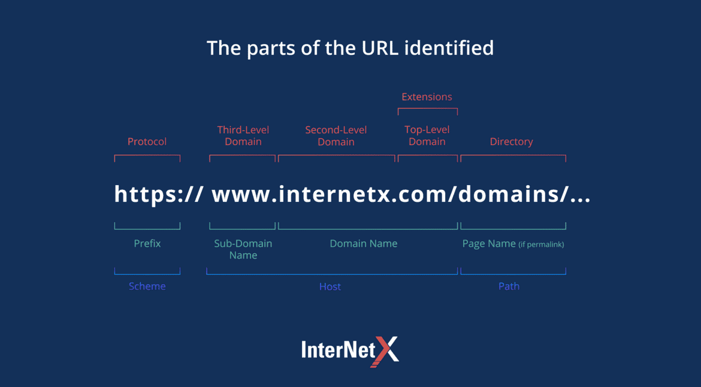

# AWS Route 53<!-- omit in toc -->

## Contents <!-- omit in toc -->

- [1. What is DNS?](#1-what-is-dns)
  - [1.1. DNS Terminologies](#11-dns-terminologies)
  - [1.2. How DNS Works](#12-how-dns-works)
- [2. Amazon Route 53](#2-amazon-route-53)
  - [2.1. Records](#21-records)
  - [2.2. Record Types](#22-record-types)
  - [2.3. Hosted Zones](#23-hosted-zones)
  - [2.4. Public vs. Private Hosted Zones](#24-public-vs-private-hosted-zones)
  - [2.5. Records TTL (Time To Live)](#25-records-ttl-time-to-live)
  - [2.6. CNAME vs Alias](#26-cname-vs-alias)
  - [2.7. Route 53 – Alias Records](#27-route-53--alias-records)
  - [2.8. Route 53 – Alias Records Targets](#28-route-53--alias-records-targets)

# 1. What is DNS?

- Domain Name System which translates the human friendly hostnames into the machine IP addresses:
  - www.google.com => 172.217.18.36
  - DNS is the backbone of the Internet
  - DNS uses hierarchical naming structure:
    - example.com
    - .com
    - api.example.com
    - www.example.com

## 1.1. DNS Terminologies

- **Domain Registrar:** Amazon Route 53, GoDaddy, ...
- **DNS Records:** A, AAAA, CNAME, NS, ...
- **Zone File:** contains DNS records.
- **Name Server:** resolves DNS queries (Authoritative or Non-Authoritative).
- **Top Level Domain (TLD):** .com, .us, .in, .gov, .org, ...
- **Second Level Domain (SLD):** amazon.com, google.com, ...

## 1.2. How DNS Works

# 2. Amazon Route 53

- A highly available, scalable, fully managed and Authoritative DNS.
  - Authoritative = the customer (you) can update the DNS records.
- **Route 53 is also a Domain Registrar**.
- Ability to check the health of your resources.
- The only AWS service which provides 100% availability SLA.
- Why Route 53? 53 is a reference to the traditional DNS port.

## 2.1. Records

- How you want to route traffic for a domain.
- Each record contains:
  - **Domain/subdomain Name:** E.g., example.com
  - **Record Type:** E.g., A or AAAA
  - **Value:** E.g., 12.34.56.78
  - **Routing Policy:** How Route 53 responds to queries.
  - **TTL:** Amount of time the record cached at DNS Resolvers.
- Route 53 supports the following DNS record types:
  - (must know) A / AAAA / CNAME / NS
  - (advanced) CAA / DS / MX / NAPTR / PTR / SOA / TXT / SPF / SRV

## 2.2. Record Types

- **A:** maps a hostname to IPv4
- **AAAA:** maps a hostname to IPv6
- **CNAME:** maps a hostname to another hostname
  - The target is a domain name which must have an A or AAAA record
  - Can't create a CNAME record for the top node of a DNS namespace (Zone Apex)
  - Example: you can't create for example.com, but you can create for www.example.com
- **NS:** Name Servers for the Hosted Zone
  - Control how traffic is routed for a domain

## 2.3. Hosted Zones

- A container for records that define how to route traffic to a domain and its subdomains.
- **Public Hosted Zones:**
  - Contains records that specify how to route traffic on the Internet (public domain names) **application1.mypublicdomain.com**.
- **Private Hosted Zones:**
  - Contain records that specify how you route traffic within one or more VPCs (private domain names) **application1.company.internal**.
- **You pay $0.50 per month per hosted zone.**

## 2.4. Public vs. Private Hosted Zones

## 2.5. Records TTL (Time To Live)

- **High TTL – e.g., 24 hr.**
  - Less traffic on Route 53.
  - Possibly outdated records.
- **Low TTL – e.g., 60 sec.**
  - More traffic on Route 53 ($$).
  - Records are outdated for less time.
  - Easy to change records.
- **Except for Alias records, TTL is mandatory for each DNS record.**

## 2.6. CNAME vs Alias

- AWS Resources (Load Balancer, CloudFront...) expose an AWS hostname:
  - **lb1-1234.us-east-2.elb.amazonaws.com** and you **want myapp.mydomain.com**
- CNAME:
  - Points a hostname to any other hostname. (app.mydomain.com => blabla.anything.com).
  - ONLY FOR NON ROOT DOMAIN (aka. something.mydomain.com).
- Alias:
  - Points a hostname to an AWS Resource (app.mydomain.com => blabla.amazonaws.com).
  - **Works for ROOT DOMAIN and NON ROOT DOMAIN (aka mydomain.com).**
  - Free of charge.
  - Native health check.

## 2.7. Route 53 – Alias Records

- Maps a hostname to an AWS resource.
- An extension to DNS functionality.
- Automatically recognizes changes in the resource's IP addresses.
- Unlike CNAME, it can be used for the top node of a DNS namespace (Zone Apex), e.g.: example.com
- Alias Record is always of type A/AAAA for AWS resources (IPv4 / IPv6).
- **You can't set the TTL.**

## 2.8. Route 53 – Alias Records Targets

- Elastic Load Balancers.
- CloudFront Distributions.
- API Gateway.
- Elastic Beanstalk environments.
- S3 Websites.
- VPC Interface Endpoints.
- Global Accelerator accelerator.
- Route 53 record in the same hosted zone.
- **You cannot set an ALIAS record for an EC2 DNS name.**
