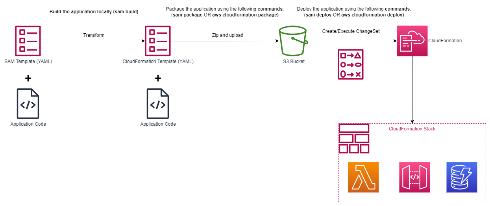

# AWS SAM - Serverless Application Model <!-- omit in toc -->

## Contents <!-- omit in toc -->

- [1. Introduction](#1-introduction)
- [2. Recipe](#2-recipe)
- [3. CLI Debugging](#3-cli-debugging)
- [4. Policy Templates](#4-policy-templates)
- [5. SAM and CodeDeploy](#5-sam-and-codedeploy)
- [6. Local Capabilities](#6-local-capabilities)
- [7. Summary](#7-summary)
- [8. Serverless Application Repository (SAR)](#8-serverless-application-repository-sar)

# 1. Introduction

- SAM = Serverless Application Model.
- Framework for developing and deploying serverless applications.
- All the configuration is YAML code.
- Generate complex CloudFormation from simple SAM YAML file.
- Supports anything from CloudFormation: Outputs, Mappings, Parameters, Resources...
- Only two commands to deploy to AWS.
- SAM can use CodeDeploy to deploy Lambda functions.
- SAM can help you to run [Lambda](AWS%20Lambda.md, [API Gateway](AWS%20API%20Gateway.md), [DynamoDB](AWS%20DynamoDB.md) locally.

# 2. Recipe

- Transform Header indicates it's SAM template:
  - Transform: 'AWS::Serverless-2016-10-31'
- Write Code
  - AWS::Serverless::Function
  - AWS::Serverless::Api
  - AWS::Serverless::SimpleTable
- Commands to package and deploy respectively:
  - CloudFormation
    - `aws cloudformation package`
    - `aws cloudformation deploy`
  - AWS SAM
    - `sam package`
    - `sam deploy`

# 3. CLI Debugging

- Locally build, test, and debug your serverless applications that are defined using AWS SAM templates.
- Provides a lambda-like execution environment locally.
- SAM CLI + AWS Toolkits => step-through and debug your code.
- Supported IDEs: AWS Cloud9, Visual Studio Code, JetBrains, PyCharm, IntelliJ, ...
- **AWS Toolkits:** IDE plugins which allows you to build, test, debug, deploy, and invoke Lambda functions built using AWS SAM.

# 4. Policy Templates

- List of templates to apply permissions to your Lambda Functions.
- [Full list available here](https://docs.aws.amazon.com/serverless-application-model/latest/developerguide/serverless-policy-templates.html)
- Important examples:
  - `S3ReadPolicy`: Gives read only permissions to objects in S3.
  - `SQSPollerPolicy`: Allows to poll an SQS queue.
  - `DynamoDBCrudPolicy`: CRUD = create read update delete.

# 5. SAM and CodeDeploy

- **SAM framework natively uses CodeDeploy to update Lambda functions.**
- Traffic Shifting feature.
- Pre and Post traffic hooks features to validate deployment (before the traffic shift starts and after it ends).
- Easy & automated rollback using CloudWatch Alarms.

# 6. Local Capabilities

- **Locally start AWS Lambda**
  - `sam local start-lambda`
  - Starts a local endpoint that emulates AWS Lambda.
  - Can run automated tests against this local endpoint.
- **Locally Invoke Lambda Function**
  - `sam local invoke`
  - Invoke Lambda function with payload once and quit after invocation completes.
  - Helpful for generating test cases.
  - If the function make API calls to AWS, make sure you are using the correct `--profile` option.
- **Locally Start an API Gateway Endpoint**
  - sam local start-api
  - Starts a local HTTP server that hosts all your functions
  - Changes to functions are automatically reloaded
- **Generate AWS Events for Lambda Functions**
  - sam local generate-event
  - Generate sample payloads for event sources
  - S3, API Gateway, SNS, Kinesis, DynamoDB...

# 7. Summary

- SAM is built on CloudFormation.
- SAM requires the Transform and Resources sections.
- Commands to know:
  - `sam build`: fetch dependencies and create local deployment artifacts
  - `sam package`: package and upload to Amazon S3, generate CF template
  - `sam deploy`: deploy to CloudFormation
- SAM Policy templates for easy IAM policy definition
- SAM is integrated with CodeDeploy to do deploy to Lambda aliases

# 8. Serverless Application Repository (SAR)

- **Allows you to share your Serverless applications packages using SAM with other AWS accounts**
- Managed repository for serverless applications.
- The applications are packaged using SAM.
- Build and publish applications that can be re-used by organizations.
  - Can share publicly.
  - Can share with specific AWS accounts.
- This prevents duplicate work, and just go straight to publishing.
- Application settings and behaviour can be customized using Environment variables.
