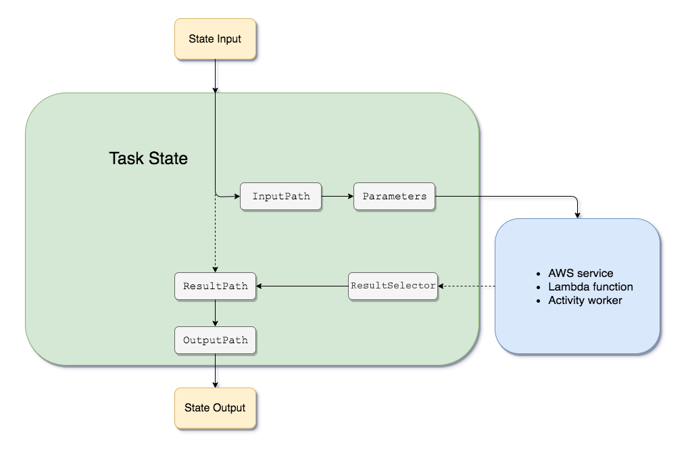

# AWS Step Functions <!-- omit in toc -->

## Contents <!-- omit in toc -->

- [1. Introduction](#1-introduction)
- [2. Task States](#2-task-states)
  - [2.1. Others states](#21-others-states)
- [3. Amazon States Language](#3-amazon-states-language)
- [4. Error Handling in Step Functions](#4-error-handling-in-step-functions)
  - [4.1. Retry (Task or Parallel State)](#41-retry-task-or-parallel-state)
  - [4.2. Catch (Task or Parallel State)](#42-catch-task-or-parallel-state)
- [5. Wait for Task Token](#5-wait-for-task-token)
- [6. Activity Tasks](#6-activity-tasks)

# 1. Introduction

- **AWS Step Functions is a low-code visual workflow service used to orchestrate AWS services, automate business processes, and build Serverless applications. It manages failures, retries, parallelization, service integrations, ...**
- Model your **workflows** as **state machines (one per workflow)**:
  - Order fulfillment, Data processing.
  - Web applications, Any workflow.
- Written in JSON.
- Visualization of the workflow and the execution of the workflow, as well as history.
- Start workflow with SDK call, API Gateway, Event Bridge (CloudWatch Event).

# 2. Task States

- Do some work in your state machine.
- Invoke one AWS service:
  - Can invoke a **Lambda function**.
  - Run an AWS Batch job.
  - Run an ECS task and wait for it to complete.
  - Insert an item from DynamoDB.
  - Publish message to SNS, SQS.
  - Launch another Step Function workflow...
- Run an one Activity:
  - EC2, Amazon ECS, on-premises.
  - Activities poll the Step functions for work.
  - Activities send results back to Step Functions.

## 2.1. Others states

- **Choice State:** Test for a condition to send to a branch (or default branch).
- **Fail or Succeed State:** Stop execution with failure or success.
- **Pass State:** Simply pass its input to its output or inject some fixed data, without performing work.
- **Wait State:** Provide a delay for a certain amount of time or until a specified time/date.
- **Map State:** Dynamically iterate steps.
- **Parallel State:** Begin parallel branches of execution.

# 3. Amazon States Language

- In the Amazon States Language, these fields filter and control the flow of JSON from state to state:
  - `InputPath`
    - Selects **WHAT** portion of the entire input payload to be used as a task's input.
  - `Parameters`
    - Specifies **HOW** the input should look like before invoking the task.
  - `ResultSelector`
    - Specifies HOW the input should look like before invoking the task.
  - `ResultPath`
    - Determines **WHERE** to put a task's output.
    - Use the `ResultPath` to determine whether the output of a state is a copy of its input, the result it produces, or a combination of both.
  - `OutputPath`
    - Determines **WHAT** to send to the next state.
    - With `OutputPath`, you can filter out unwanted information, and pass only the portion of JSON data that you care about.



# 4. Error Handling in Step Functions

- Any state can encounter runtime errors for various reasons:
  - State machine definition issues (for example, no matching rule in a Choice state).
  - Task failures (for example, an exception in a Lambda function).
  - Transient issues (for example, network partition events).
- Use `Retry` (to retry failed state) and `Catch` (transition to failure path) in the State Machine to handle the errors instead of inside the Application Code.
- Predefined ERROR codes:
  - `States.ALL`: matches any error name
  - `States.Timeout`: Task ran longer than TimeoutSeconds or no heartbeat received
  - `States.TaskFailed`: execution failure
  - `States.Permissions`: insufficient privileges to execute code
- The state may report is own errors.

## 4.1. Retry (Task or Parallel State)

- Evaluated from top to bottom.
- `ErrorEquals` - Match a specific kind of error.
- `IntervalSeconds` - Initial delay before retrying.
- `BackoffRate` - Multiple the delay after each retry.
- `MaxAttempts` - Default to 3, set to 0 for never retried.
- When max attempts are reached, the `Catch` kicks in.
- Example:
  ```
    "Retry":
    [
      {
        "ErrorEquals": [ "States.Timeout" ],
        "IntervalSeconds": 3,
        "MaxAttempts": 2,
        "BackoffRate": 1
      }
    ]
  ```

## 4.2. Catch (Task or Parallel State)

- Evaluated from top to bottom:
  - `ErrorEquals` - Match a specific kind of error, a non-empty array of strings that match error names.
  - `Next`: State to send to, a string that must exactly match one of the state machine's state names.
  - `ResultPath` - A path that determines what input is sent to the state specified in the Next field.
- Example:
  ```
    {
      "NoMessage": {
      "Type": "Task",
        "Resource": "arn:aws: lambda: ap-northeast-1:
        "Catch": [{
          "ErrorEquals": ["States.ALL"],
          "ResultPath": "$.error",
          "Next": "Cause Of Error"
        }],
        "TimeoutSeconds": 1,
        "End": true
      },
      "Cause Of Error": {
        "Type": "Pass",
        "ResultPath": "$.response",
        "Result": "An error has occured.",
        "End": true
      }
    }
  ```

# 5. Wait for Task Token

- Allows you to pause Step Functions during a Task until a Task Token is returned
- Task might wait for other AWS services, human approval, 3rd party integration, call legacy systems...
- Append `.waitForTaskToken` to the **Resource** field to tell Step Functions to wait for the Task Token to be returned
- Task will pause until it receives that Task Token back with a `SendTaskSuccess` or `SendTaskFailure` API call.

# 6. Activity Tasks

- Enables you to have the Task work performed by an **Activity Worker**.
- **Activity Worker** apps can be running on EC2, Lambda, mobile device...
- Activity Worker poll for a Task using `GetActivityTask` API.
- After Activity Worker completes its work, it sends a response of its success/failure using `SendTaskSuccess` or `SendTaskFailure`.
  - To keep the Task active:
    - Configure how long a task can wait by setting `TimeoutSeconds`.
    - Periodically send a heartbeat from your Activity Worker using `SendTaskHeartBeat` within the time you set in `HeartBeatSeconds`.
  - By configuring a long `TimeoutSeconds` and actively sending a heartbeat, Activity Task can wait up to 1 year.
